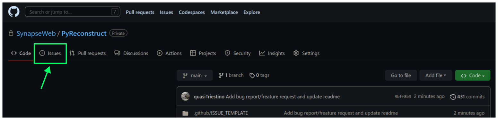

# Table of Contents

1.  [PyReconstruct](#pyreconstruct)
2.  [Submitting bug reports and feature requests](#submitting-bug-reports-and-feature-requests)
3.  [Installation](#installation)
    1.  [Checking your version of Python](#checking-your-version-of-python)
    2.  [Installing git](#installing-git)
    3.  [Cloning this repository](#cloning-this-repository)
    4.  [Launching PyReconstruct for the first time](#launching-pyreconstruct-the-first-time)
    5.  [Updating](#updating)
    6.  [Uninstalling](#uninstalling)
4.  [Getting started](#getting-started)
    1.  [Launching PyReconstruct](#launching-pyreconstruct)
    2.  [The main window](#the-main-window)
    3.  [Starting a new series](#starting-a-new-series)
    4.  [Movements](#movements)
    5.  [Your first object](#your-first-object)
    6.  [Exiting](#exiting)

# PyReconstruct

PyReconstruct is an actively maintained, extensible version of **RECONSTRUCT** written entirely in Python. We are currently in alpha testing, but we are happy to make the program available now.

Because PyReconstruct is undergoing rapid changes, we are not yet ready to provide a single executable file. For the time being, you can download the source code through this GitHub repository. Instructions on installing and running PyReconstruct follow below.

# Submitting bug reports and feature requests

PyReconstruct is hot off the presses and inevitably there will be bugs. If you notice a problem, would like to suggest a feature, or have ideas on improving our documentation, click `Issues` at the top of this page and then `New Issue`.

We appreciate the help!

# Installation

PyReconstruct can be installed on just about any major operating system. Installing PyReconstruct is a 3-step process:

1.  Make sure you have `Python 3.9` or `3.10` and `git`.
2.  Clone the repository to your local machine.
3.  Install PyReconstruct's dependencies. (This step can be partially automated.)

## Checking your version of Python

To check which version of Python you currently have, run the command `python --version` in a terminal.

-   Windows: Click `START` and search for `command prompt`.

-   Mac: Search  for the `Terminal` app.

If there is an error (which likely means Python is not installed) or if you need to upgrade, you should install/re-install Python.

-   Windows: Python can be downloaded [here](https://apps.microsoft.com/store/detail/python-310/9PJPW5LDXLZ5) in the Microsoft app store.

-   Mac: Python can be downloaded [here](https://www.python.org/downloads/release/python-3109/). Scroll to the bottom of the page and find the macOS installer.

Once Python has been downloaded, restart the command prompt and re-run `python --version` to see if you have successfully installed Python.

## Installing git

Installing `git` it is very simple.

-   Windows: `git` can be downloaded [here](https://git-scm.com/download/win). (On most modern computers, use the 64-bit installer.)

-   Mac: `git` comes packaged with `Xcode`, which can be found [here](https://apps.apple.com/us/app/xcode/id497799835?mt=12). **Even if you already have git installed, make sure Xcode is installed**. (`Xcode` is required for installing dependencies needed by PyReconstruct.)

## Cloning this repository

*Cloning* is similar to copying the code in a repository onto your local machine. However, unlike copying the code directly, a clone remains "linked" to the repository hosted on GitHub, and any changes we make remotely can be incorporated into your cloned copy.

Cloning can be done through through automated install scripts or through `git`'s command line interface. You can clone the repository anywhere you like on your machine.

### Install scripts (automated install)

(If you have not already been provided an install script, it can be found in your operating system's folder under the `launch` directory.)

-   Place the install script anywhere where you'd like the PyReconstruct source code to live.

-   Mac users must explicitly give the user permission to execute this script.
    
    To do this, right-click and copy the path of the install script. Then, open the Terminal app and run the following command:
    
    `chmod u+x <path to install script>`
    
    (For example, `chmod u+x Desktop/PyReconstruct/mac_install.command`.)

-   For both Windows and Mac users, run the install script by double-clicking on the file.

### Command line

Cloning the repository via `git` is even simpler if you're comfortable using the command line: `git clone https://www.github.com/SynapseWeb/PyReconstruct /destination/path/to/a/new/local/repo`

## Launching PyReconstruct for the first time

PyReconstruct depends on other Python packages to run (hence, "dependencies"). Installing and checking dependencies is done automatically, but they can be downloaded manually if you prefer managing them yourself.

### Automated installation

If you don't want to hassle with installing dependencies manually, we have written convenience scripts that do this for you.

1.  Open the PyReconstruct repository. (This is the location where the original install script was stored).

2.  Open the `launch` subdirectory and find your operating system's directory.

3.  Double-click on the `run` script.

4.  A console window will open and installation will begin if necessary.

5.  Wait until dependencies have been installed. (This might take several minutes.)

6.  After installation, PyReconstruct will open.

7.  Any time you'd like to run PyReconstruct, you can reopen the launch script. (This script will automatically check for any updates and download them.)

8.  Make a shortcut/alias of the `run` script and place it anywhere on your computer you'd like. (Note: Only move the shortcut and not the launch script itself.)

### Manual installation

Dependencies needed to run pyReconstruct can be found at `src/requirements.txt`. You can install dependencies via PIP:

`pip install -r src/requirements.txt`

Virtual environments like Python's built-in *venv* module are an excellent way of managing dependencies needed to run PyReconstruct. Here is an example of installing dependencies in a newly created virtual environment on Linux and Mac machines:

1.  Change the current working directory to your local copy of this repo:
    
    `cd /path/to/local/repo`

2.  Create a virtual environment (for this example, we will call it `env`):
    
    `python -m venv env`

3.  Activate the virtual environment:
    
    `source env/bin/activate`

4.  Install dependencies:
    
    `pip install -r src/requirements.txt`

The instructions above can be tailored to your own purposes. You do you.

Launch the application by running the following: `python src/pyReconstruct.py`

## Updating

We are in the process of making many changes to PyReconstruct and having a way of easily updating the program on your local machine is crucial. Like cloning the repository, incorporating the newest changes on your local machine can be done using git's command line interface or through the GitHub Desktop application. In either case, changes hosted in this GitHub repository will be reflected in your local clone.

Updates are automatically installed when running the `run` scripts. However, you can update your repo manually using the command line.

### Git command line interface

1.  In a terminal, navigate to the cloned PyReconstruct repository: `cd /path/to/repo`

2.  Fetch changes from the remote: `git fetch`

3.  Pull changes into your local repository: `git pull`

(If there are conflicts and you'd like to reset everything to the most up-to-date version of the repository, you can hard reset from the remote main branch: `git fetch --all && git reset --hard origin/main`. Be thee forewarned: This will destroy any changes you've made to the local repository.)

## Uninstalling

If you'd like to uninstall PyReconstruct, simply delete the entire PyReconstruct repository on your local machine.

# Getting started

## Launching PyReconstruct

### After automated installation

If you followed the steps above to automatically install dependencies, start PyReconstruct by finding your operating system's `run` script in the `launch` subdirectory of your local repository.

You can right-click on this file and make a shortcut/alias, which can be place anywhere on your machine. (Do not move the actual launch script itself, only the shortcut.)

### After manual installation

If you installed PyReconstruct manually, refer to the instructions above that outline dependency installation. If you are using a virtual environment, activate it and run the following command: `python src/PyReconstruct.py`

## The main window

When you first open PyReconstruct, you will see a welcome image over a black field. This is the **main window** and where the majority of your time will be spent. The various parts of the main window are outlined in the figure below.

Note: PyReconstruct leverages your operating system's default look and feel, which means PyReconstruct's user interface (the app's look) will differ slightly depending on what kind of machine you are using.

### Tools palette

There are 6 tools available in the **tools palette** located on the right side of the main window. Each tool can be accessed by clicking or through a keyboard shortcut:

1.  Pointer / select (`P`)
2.  Pan / Zoom (`Z`)
3.  Knife (`K`)
4.  Closed trace (`C`)
5.  Open trace (`O`)
6.  Stamp (`S`)

Hovering over each tool reveals its name and shortcut.

(Note: `Shift-L` will move the tool palette, the brightness/contrast, and the change section buttons to the other side of the main window, which left-handed users might find useful when reconstructing on a tablet.)

### Trace palette

Trace attributes can be quickly accessed through the **trace palette**, a set of 20 user-defined attributes at the bottom of the main window. Each trace palette item can be changed by right-clicking and editing its attributes. The name of the currently selected trace attributes appears above the trace palette.

To make a trace palette item active, left-click on it or press a number on the keyboard. (`1` through `0` will select each of items 1-10. `Shift-1` through `Shift-0` will select items 11-20.)

(Note: You can also edit a trace items attributes quickly, by pressing `Ctrl` + the item's corresponding number. For example, `Ctrl-1` will open the edit attributes menu for the first trace item. `Ctrl-Shift-1` will open the trace attributes for the eleventh item.)

## Starting a new series

The only requirement to start a new series is a set of images which can be in a variety of formats (TIFF, JPEG, PNG, BMP, etc.)

(Note: All series and trace files will be placed in the folder that contains your images. These files can be moved later.)

1.  Place your images in a folder somewhere on your local machine.
2.  Open PyReconstruct.
3.  To start a new series, in the menu bar `File` → `New` or simply `Ctrl-N`.
4.  Select the images you would like to include in your series.
5.  Enter a series name.
6.  Enter a calibration value (default = 0.00254 μm/px).
7.  Enter a section thickness (default = 0.055 μm).
8.  Center the view by pressing `Home`.

## Movements

We'd like to minimize the amount of time a user spends moving the cursor to and from the tool and trace palettes while tracing. In many cases, keyboard shortcuts allow the user to access options quickly. We have also taken advantage of the fact that most modern mice have multiple buttons.

**Moving around the image** (panning and zooming) can be done in several ways.

1.  Selecting the pan/zoom tool (accessed in the tool palette or by pressing `Z`):
    -   Panning: Hold down `left mouse button` and move cursor.
    -   Zooming: Hold down `right mouse button` and move cursor up and down.

2.  In any tool mode (in other words, without the pan/zoom tool selected):
    -   Panning: Hold down `middle mouse button` and move cursor.
    -   Zooming: Press and hold `Ctrl` while scrolling the mouse wheel.

3.  For touchscreen computers, use two fingers to pan and zoom (in any tool mode).

**Moving to another section** can also be done in several ways.

1.  Scrolling the mouse wheel.
2.  `Ctrl-G` ("G" for "go to"), which will prompt you for a section number.
3.  In the menu bar, `Section` → `Go to section`.

## Your first object

### Tracing an object

1.  Select a trace palette item by click on it or pressing a number.

2.  Right-click on it to edit its attributes.

3.  Change the item's attributes and click `OK`.

4.  To trace a closed object, select the closed trace tool in the tool palette (or press `C` for "closed").

5.  Press and hold the `left mouse button` while tracing the outline of an object.

6.  Release the `left mouse button` to finish the trace.

7.  To draw a polygon, click multiple points along an object and finish by right-clicking.

There are three different tools to create traces:

1.  Closed Trace (`C`): this tool will create a closed polygon (keeping only the exterior)

2.  Open Trace (`O`): this tool will create an open polyline

3.  Stamp (`S`): this tool will create a trace the shape as displayed on the palette. The trace is centered on the mouse, and its size can be changed by modifying its radius through the trace palette.

The Knife tool (`K`) can be used to trim traces. This can only be done on **one selected trace** at a time.

Remember, you can pan and zoom while tracing without changing to the pan/zoom tool.

Note: Legacy Reconstruct had separate polygon and pencil tools, which in PyReconstruct have been collapsed into a single tool. To draw a polygon, simply click points while tracing. To draw using the pencil, simply click and hold while tracing. These actions also work for open traces.

### Selecting / deselecting the object

When you're done tracing, the trace will be selected, which is visually cued by highlighting. To deselect the trace, left-click it. To re-select it, left-click again.

### Editing a trace's attributes

With the trace selected, right-click on it. This will open a menu with options. Clicking on `edit trace attributes` will allow you to change the attributes of all selected traces. You can also access the attributes of all traces selected on a section with `Ctrl-E` ("E" for "edit").

### Moving the trace

Like in legacy Reconstruct, selected traces can be moved by using the arrow keys. (Minor adjustments are made by holding down `Ctrl` while pressing the arrow keys.)

In PyReconstruct, you can also left-click and drag selected traces around the field without the need to use the arrow keys.

### Undo / redo

Undo an action with `Ctrl-Z` and redo the action with `Ctrl-Y`.

## Exiting

Exiting PyReconstruct can be done through `File` → `Quit` or `Ctrl-Q`. You will be given the option to save your changes on exit.

(Note: If, for some reason, PyReconstruct or your computer crashes, the data created during the previous session will be saved in a hidden folder in your working directory. The next time you launch PyReconstruct, you will be asked if you would like to incorporate the previously unsaved data.)

