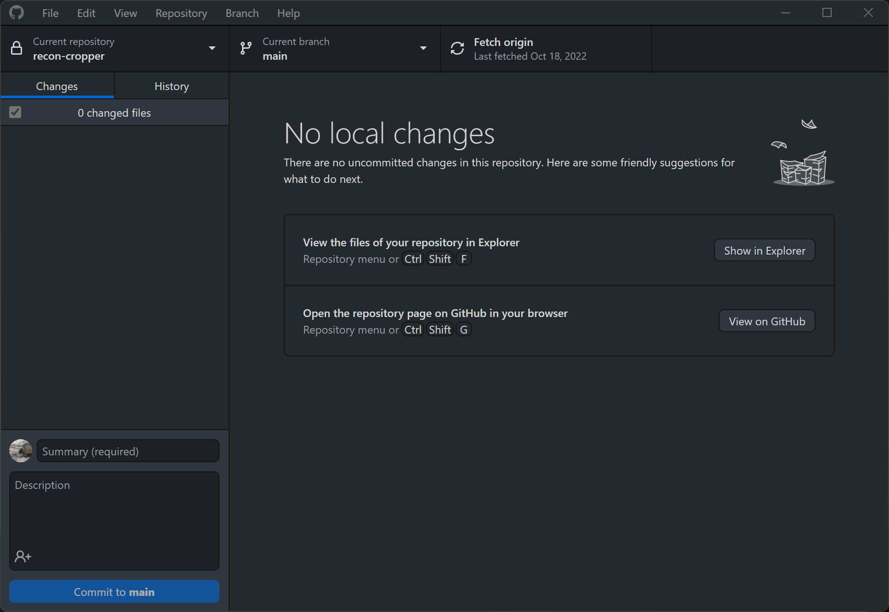
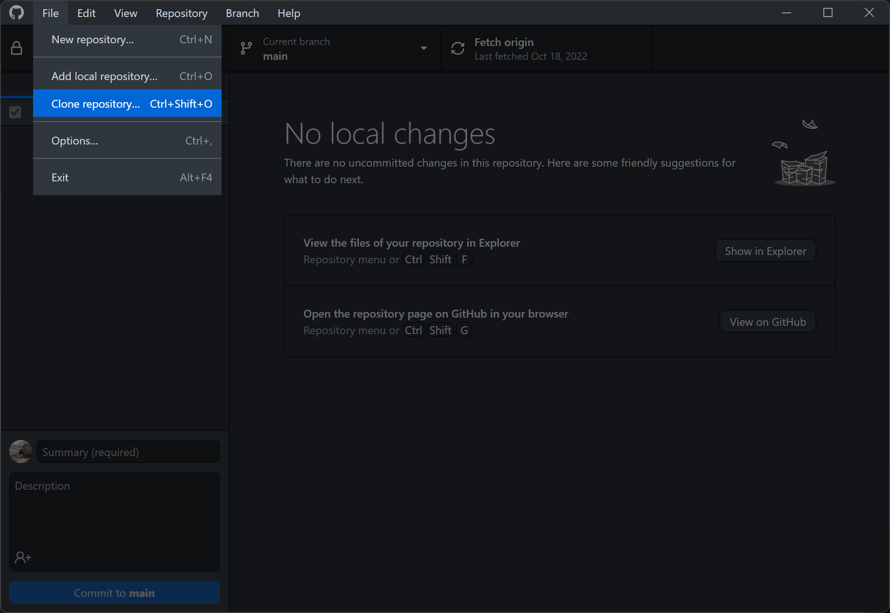
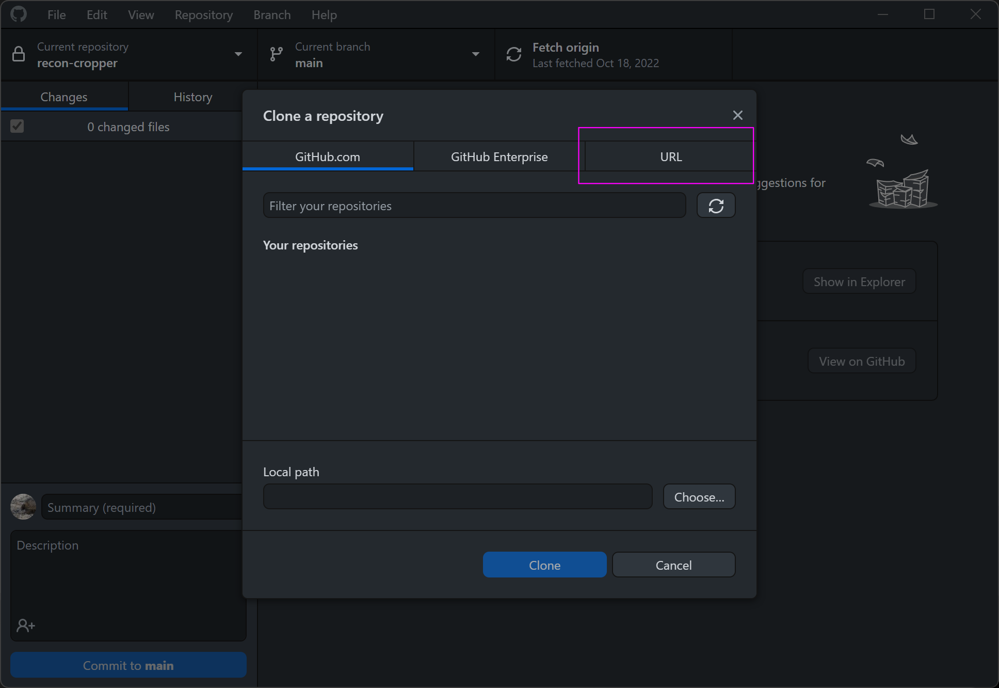
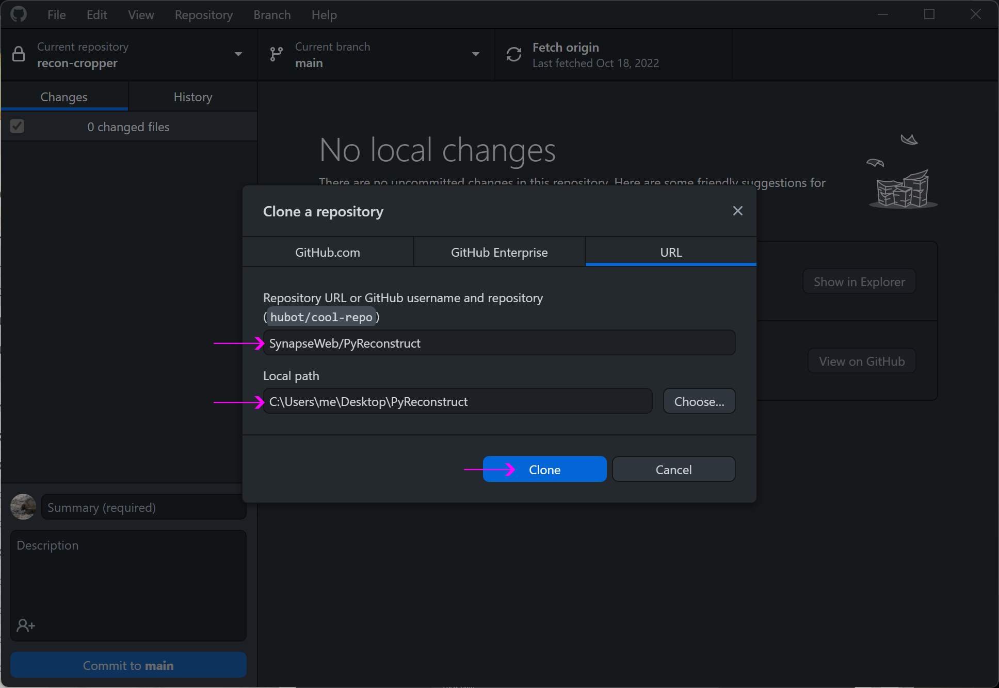
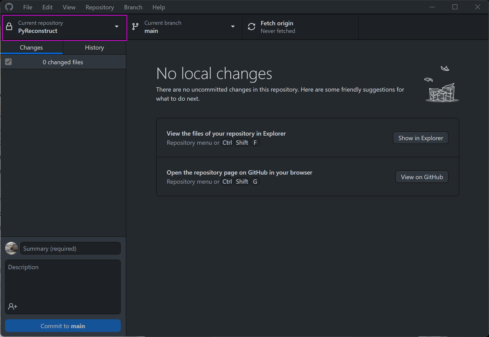
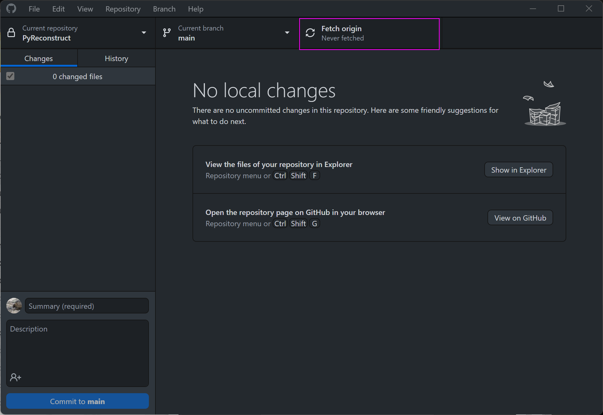
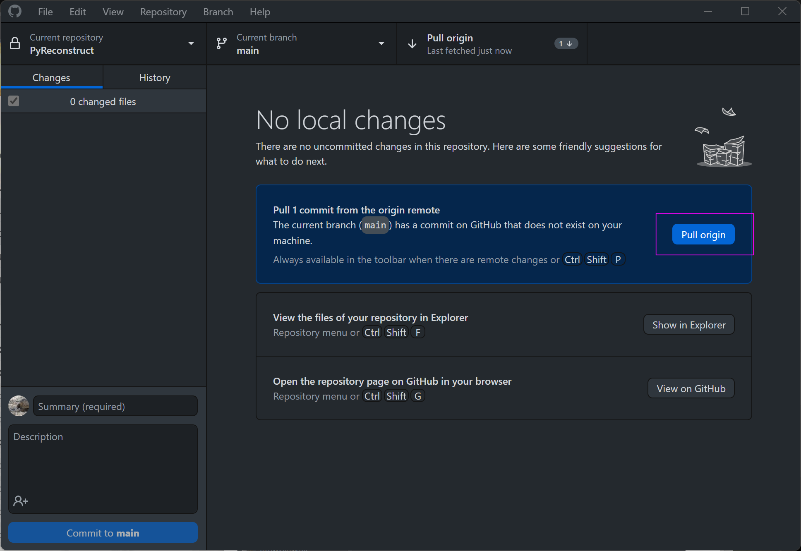
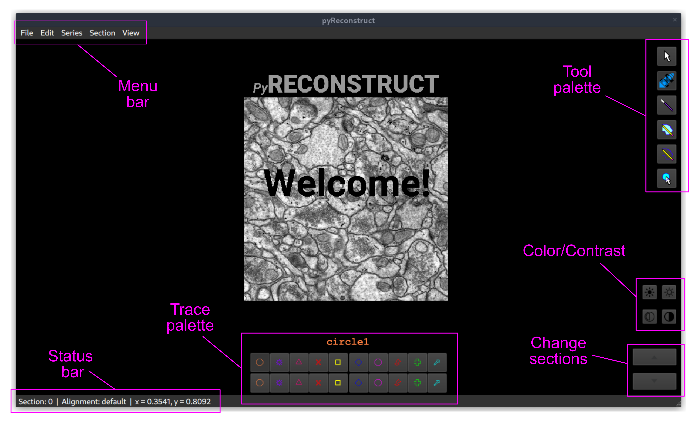

# Table of Contents

1.  [PyReconstruct](#org4124ab0)
2.  [Installation](#orgc74aa46)
    1.  [Checking your version of Python](#orgb6eaeeb)
    2.  [Cloning this repository](#org3f9d640)
    3.  [Installing dependencies](#org9a732af)
    4.  [Updating](#orgfe6c30d)
    5.  [Uninstalling](#orgcf52bc7)
3.  [Getting started](#orgc77047a)
    1.  [Launching PyReconstruct](#org9e99a30)
    2.  [The main window](#org865f790)
    3.  [Starting a new series](#orga3e4997)
    4.  [Movements](#org847a6fc)
    5.  [Your first object](#org15945a9)
    6.  [Exiting](#org05c114e)
4.  [Other information](#org0b71187)
    1.  [Repository structure](#org02e3c36)

# PyReconstruct

PyReconstruct is an actively maintained, updated, and extensible version of **RECONSTRUCT** written entirely in Python. We are currently alpha-testing this program, but we are more than happy to make it available now.

Because PyReconstruct is undergoing rapid changes, we are not yet ready to provide a single executable file. For the time being, to access PyReconstruct you will need to download the code through this GitHub repository. We have worked hard to make this process as painless as possible.

# Installation

Installing PyReconstruct is a 3-step process:

1.  Make sure you have Python 3.9 or higher.
2.  Clone the repository to your local machine.
3.  Install dependencies required to run PyReconstruct.

(Do not fret, Windows users! We have written scripts that automate the process of installing dependencies.)

## Checking your version of Python

To check which version of Python you currently have, run the command `python --version` in a terminal. (In Windows, this can be down by clicking `START` and searching for `command prompt`. In the command prompt window, type `python --version` and press enter.)

The above command will output which version of Python you are running. You should be running Python 3.9 or higher for PyReconstruct. If there is an error (likely means Python is not installed) or if you need to upgrade, search for and download Python. In Windows, this can be done in the Microsoft App Store.

Once downloaded, you can restart the command prompt and re-run `python --version` to see if you have successfully installed Python.

## Cloning this repository

*Cloning* is similar to copying the code in a repository onto your local machine. However, unlike copying the code directly, a clone remains "linked" to the repository hosted on GitHub, and any changes we make remotely can be easily and quickly incorporated into your cloned copy.

Cloning can be done through git's command line interface or through GitHub's excellent desktop application. You can clone the repository anywhere you like on your machine.

### GitHub Desktop

1.  Download and install GitHub's desktop application [here](https://desktop.github.com/).

2.  Open the GitHub Desktop application after installing.

    

3.  `File` → `Clone repository`.

    

4.  Click on `URL`.

    

5.  Insert `SynapseWeb/PyReconstruct` and a `destination folder` where the repo will be stored on your local machine. Then click `Clone`.

    

6.  The PyReconstruct repository will be downloaded onto your local machine.

    You can move the folder wherever you'd like after cloning the repository. Keep in mind, however, that you will need to update the location in the GitHub Desktop application in order to update the repository.

### Command line

Cloning the repository via `git` is even simpler if you're comfortable using the command line.

1.  Make sure you have `git`. (For Windows, `git` can be downloaded [here](https://git-scm.com/download/win).)

2.  Clone the respository: `git clone https://www.github.com/SynapseWeb/PyReconstruct /destination/path/to/a/new/local/repo`

## Installing dependencies

PyReconstruct depends (hence, "dependencies") on a host of other Python packages that must be downloaded in order to run the program. For Windows users, we have automated this process.

### Automated installation (Windows)

If you don't want to hassle with installing dependencies manually, we have written a convenience script that does this for you.

This script will download and save dependencies in an `env` directory in the root of the repository. It will not save files anywhere else on your machine.

1.  Open the PyReconstruct repository through Windows Explorer. (This is the location you entered for *local path* when cloning the repository. If you don't remember where this is, in the GitHub Desktop app, there is a "Show in Explorer" button in the middle of the window.)
2.  Open the `windows` subdirectory.
3.  Double-click on `install.bat`.
4.  A console window will open and downloading will start automatically.
5.  Wait until dependencies have been installed. (This might take several minutes.)
6.  After installation, click any key to exit the console.

### Manual installation

Dependencies needed to run pyReconstruct can be found in this repo (`/src/requirements.txt`) and can be installed via PIP: `pip install -r src/requirements.txt`

Using virtual environments such as Python's built-in *venv* module is an excellent way of managing dependencies needed to run PyReconstruct.

Here is an example of installing dependencies in a newly created virtual environment on Linux and Mac machines:

1.  Change current working directory to your local copy of this repo: `cd /path/to/local/repo`
2.  Create a virtual environment (for this example, we will call it `env`): `python -m venv env`
3.  Activate the virtual environment: `source env/bin/activate`
4.  Install dependencies: `pip install -r src/requirements.txt`

## Updating

We are in the process of making many changes to PyReconstruct and having a way to easily update the program on your local machine is crucial. Like cloning the repository, incorporating the newest changes on your local machine can be done using git's command line interface or through the GitHub Desktop application. In either case, changes hosted in this GitHub repository will be reflected in your local clone.

### GitHub Desktop

1.  Open the GitHub Desktop application.

2.  Make sure you're in the correct repository.
    
    

3.  Fetch changes from the remote by clicking on `Fetch origin`.

1.  Pull changes into your local repository by clicking on `Pull origin`.
    
    

### Git command line interface

1.  In a terminal, navigate to the cloned PyReconstruct repository: `cd /path/to/repo`
2.  Fetch changes from the remote: `git fetch`
3.  Pull changes into your local repository: `git pull`

(If there are conflicts and you'd like to reset everything to the most up-to-date version of the repository, you can hard reset from the remote main branch: `git fetch --all && git reset --hard origin/main`. Be thee forewarned, however: This will destroy any changes you've made to the local repository.)

## Uninstalling

If you'd like to uninstall PyReconstruct, simply delete the entire PyReconstruct repository on your local machine. (If you cloned the repository through GitHub Desktop, you can also delete it there.)

# Getting started

## Launching PyReconstruct

### After automated installation (Windows)

If you followed the steps above to automatically install dependencies, start PyReconstruct by clicking on `pyReconstruct.bat` in the `windows` directory of the repository.

You can right-click on this file and make a shortcut, which can be place anywhere on your machine. (Do not move the actual `pyReconstruct.bat` file itself, only the shortcut.)

### Manually

If you are installing PyReconstruct manually, refer to the instructions above that outline dependency installation. If you are using a virtual environment, activate it and run the following command: `python src/pyReconstruct.py`

## The main window

When you first open PyReconstruct, you will see a welcome image over a black field. This is the **main window** and where the majority of your time is spent. The various parts of the main window are outlined in the figure below.

### Tools palette

There are 6 tools available in the **tools palette** located on the right side of the main window. Each tool can be accessed by clicking or through a keyboard shortcut:

1.  Pointer / select (`P`)
2.  Pan / Zoom (`Z`)
3.  Knife (`K`)
4.  Closed trace (`C`)
5.  Open trace (`O`)
6.  Stamp (`S`)

Hovering over each tool reveals its name and shortcut.

(Note: `Shift-L` will move the tool palette, the brightness/contrast, and the change section buttons to the other side of the main window, which left-handed users might find useful when reconstructing on a tablet.)

### Trace palette

Trace attributes can be quickly accessed through the **trace palette**, a set of 20 user-defined attributes at the bottom of the main window. Each trace palette item can be changed by right-clicking and editing its attributes. The name of the currently selected trace attributes appears above the trace palette.

To make a trace palette item active, left-click on it or press a number on the keyboard. (`1` through `0` will select each of items 1-10. `Shift-1` through `Shift-0` will select items 11-20.)

(Note: You can also edit a trace items attributes quickly, by pressing `Ctrl` + the item's corresponding number. For example, `Ctrl-1` will open the edit attributes menu for the first trace item. `Ctrl-Shift-1` will open the trace attributes for the eleventh item.)

## Starting a new series

The only requirement to start a new series is a set of images which can be in a variety of formats (TIFF, JPEG, PNG, BMP, etc.)

(Note: All series and trace files will be placed in the folder that contains your images. These files can be moved later.)

1.  Place your images in a folder somewhere on your local machine.
2.  Open PyReconstruct.
3.  To start a new series, in the menu bar `File` → `New` or simply `Ctrl-N`.
4.  Select the images you would like to include in your series.
5.  Enter a series name.
6.  Enter a calibration value (default = 0.00254 μm/px).
7.  Enter a section thickness (default = 0.055 μm).
8.  Center the view by pressing `Home`.

## Movements

We'd like to minimize the amount of time a user spends moving the cursor to the tool and trace palettes while tracing. In many cases, keyboard shortcuts allow the user to access options quickly. We have also taken advantage of the fact that most modern mice have multiple buttons.

**Moving around the image** (panning and zooming) can be done in several ways.

1.  Selecting the pan/zoom tool (accessed in the tool palette or by pressing `Z`):
    -   Panning: Hold down `left mouse button` and move cursor.
    -   Zooming: Hold down `right mouse button` and move cursor up and down.

2.  In any tool mode (in other words, without the pan/zoom tool selected):
    -   Panning: Hold down `middle mouse button` and move cursor.
    -   Zooming: Press and hold `Ctrl` while scrolling the mouse wheel.

**Moving to another section** can also be done in several ways.

1.  Scrolling the mouse wheel.
2.  `Ctrl-G` ("G" for "go to"), which will prompt you for a section number.
3.  In the menu bar, `Section` → `Go to section`.

## Your first object

### Tracing an object

1.  Select a trace palette item by click on it or pressing a number.
2.  Right-click on it to edit its attributes.
3.  Change the item's attributes and click `OK`.
4.  To trace a closed object, select the closed trace tool in the tool palette (or press `C` for "closed").
5.  Press and hold the `left mouse button` while tracing the outline of an object.
6.  Release the `left mouse button` to finish the trace.
7.  To draw a polygon, click multiple points along an object and finish by right-clicking.

Remember, you can pan and zoom while tracing without changing to the pan/zoom tool. 

(Note: Legacy Reconstruct had separate polygon and pencil tools, which in PyReconstruct have been collapsed into a single tool. To draw a polygon, simply click points while tracing. To draw using the pencil, simply click and hold while tracing. These actions also work for open traces.)

### Selecting / deselecting the object

When you're done tracing, the trace will be selected, which is visually cued by highlighting. To deselect the trace, left-click it. To re-select it, left-click again.

### Editing a trace's attributes

With the trace selected, right-click on it. This will open a menu with options. Clicking on `edit trace attributes` will allow you to change the attributes of all selected traces. You can also access the attributes of all traces selected on a section with `Ctrl-E` ("E" for "edit").

### Moving the trace

Like in legacy Reconstruct, selected traces can be moved by using the arrow keys. (Minor adjustments are made by holding down `Ctrl` while pressing the arrow keys.)

In PyReconstruct, you can also left-click and drag selected traces around the field without the need to use the arrow keys.

### Undo / redo

Undo an action with `Ctrl-Z` and redo the action with `Ctrl-Y`.

## Exiting

Exiting PyReconstruct can be done through `File` → `Quit` or `Ctrl-Q`. All changes to the series will be saved automatically.

# Other information

## Repository structure

This GitHub repository is structured to be easily understandable. All source files can be found under `src/` and other file types are here:

<table border="2" cellspacing="0" cellpadding="6" rules="groups" frame="hsides">

<colgroup>
<col  class="org-left" />

<col  class="org-left" />
</colgroup>
<thead>
<tr>
<th scope="col" class="org-left">File type(s)</th>
<th scope="col" class="org-left">Location</th>
</tr>
</thead>

<tbody>
<tr>
<td class="org-left">Script to launch PyReconstruct</td>
<td class="org-left">src/pyReconstruct.py</td>
</tr>

<tr>
<td class="org-left">List of dependencies</td>
<td class="org-left">src/requirements.txt</td>
</tr>

<tr>
<td class="org-left">Modules</td>
<td class="org-left">src/modules</td>
</tr>

<tr>
<td class="org-left">Images and example series</td>
<td class="org-left">src/assets</td>
</tr>

<tr>
<td class="org-left">File locations and other constants</td>
<td class="org-left">src/constants</td>
</tr>

<tr>
<td class="org-left">Notes and features</td>
<td class="org-left">notes/</td>
</tr>

<tr>
<td class="org-left">Miscellaneous</td>
<td class="org-left">misc/</td>
</tr>

<tr>
<td class="org-left">Windows-specific files</td>
<td class="org-left">windows/</td>
</tr>
</tbody>
</table>

